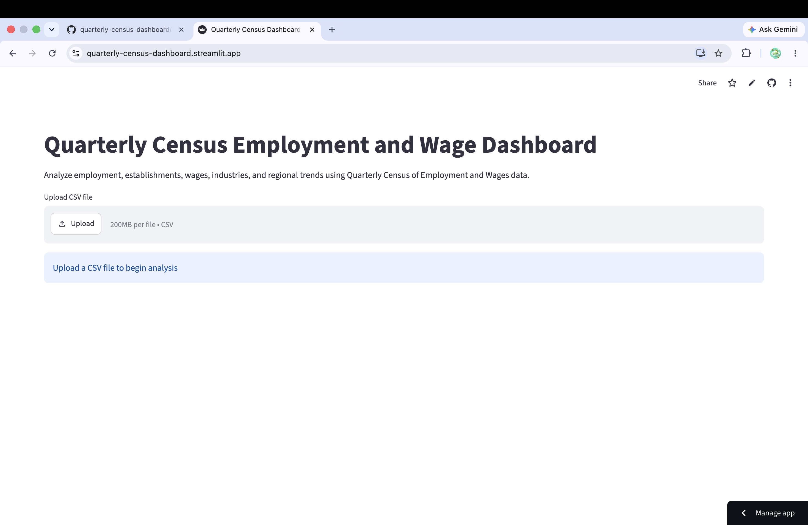

# Quarterly Census Employment and Wage Dashboard

This is an interactive data analysis dashboard built using **Python, Pandas, and Streamlit**.  
It helps explore and understand employment and wage trends using Quarterly Census datasets in a simple visual way.

---

##  Live Demo

https://quarterly-census-dashboard.streamlit.app/

---

##  What this project does

This dashboard makes it easy to explore large employment datasets without needing to manually analyze raw CSV files.

With just a file upload, you can:
- Understand employment trends over the years
- Compare industries and their growth
- Analyze wages across different regions
- Filter and explore data interactively
- Get quick statistical summaries

---

##  Features

- Upload your own CSV dataset
- Interactive employment trend visualization
- Year-wise analysis of data
- Industry and region-based insights
- Wage analysis by area
- Dynamic filtering options
- Raw data explorer for deep inspection
- Automatic summary statistics for numeric columns

---

##  Tech Stack

- Python 
- Pandas 
- Streamlit 
- Git & GitHub

---

## Dashboard Preview

Here’s a quick look at the dashboard in action:

<p align="center">




</p>

---

##  How to run this project locally

If you want to run this on your own system:

```bash
git clone https://github.com/shravanikandikonda/quarterly-census-dashboard.git
cd quarterly-census-dashboard
pip install -r requirements.txt
streamlit run app.py

---
## What I learned from this project

- Working with real-world datasets
- Building interactive dashboards using Streamlit
- Data cleaning and transformation using Pandas
- Creating meaningful insights from raw data
- Structuring a complete data analytics project

---

## Connect

GitHub: https://github.com/shravanikandikonda  
LinkedIn: add your link here

---

## Author

Built by Shravani Kandikonda
